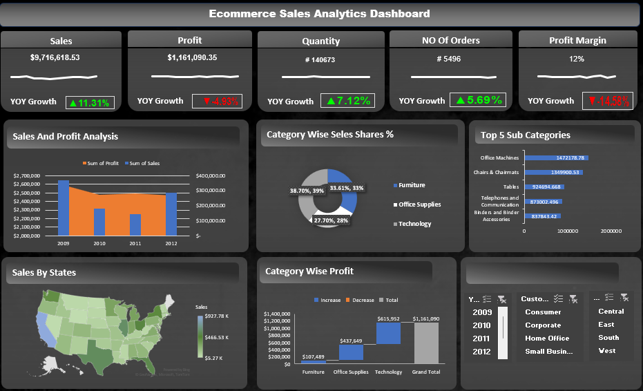
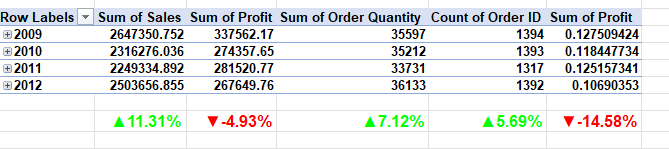

# تحلیل فروش Superstore با Excel

تحلیل داده‌های فروش یک فروشگاه با استفاده از Pivot Table، اسلایسر و چند نوع نمودار در Excel.

## داشبورد و نمودارها

## فایل

[`Superstore_Sales_Analysis.xlsx`](./Superstore_Sales_Analysis.xlsx)
